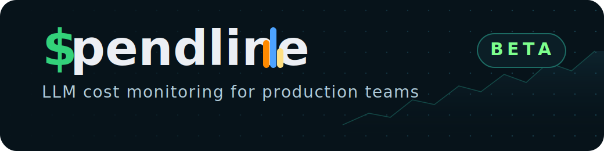

<div align="center">

<a href="https://spend-line.vercel.app">
  
</a>

Track every LLM request, understand every token bill, and catch spend spikes before they hit production budgets.

[Dashboard](https://spend-line.vercel.app) | [API](https://spendlineapi-production.up.railway.app/health) | [Docs](./doc/README.md)


</div>

## What It Is

Spendline is an LLM cost monitoring product for developers and engineering teams. It ships with Python and JavaScript SDKs that wrap model calls, capture usage and cost telemetry, and send that data to a hosted dashboard for real-time monitoring.

Core MVP capabilities:

- Python and JavaScript SDKs
- Real-time dashboard with overview, request log, alerts, API keys, and settings
- Per-request telemetry: model, provider, tokens, cost, latency, timestamp, workflow and session IDs
- Alerts for monthly thresholds and optional daily digests
- Supabase auth, Upstash queueing, and Railway/Vercel deployment targets

## SDKs

The SDKs are now publicly available:

- Python: `pip install spendline`
- JavaScript: `npm install spendline`

## Quickstart

```python
from spendline import track

response = track(
    openai.chat.completions.create(
        model="gpt-5-mini",
        messages=[{"role": "user", "content": "Hello"}],
    ),
    workflow_id="chat-feature",
    session_id="sess_123",
    metadata={"user_id": "u_456", "env": "prod"},
)
```

```ts
import { track } from "spendline"

const response = await track(
  () =>
    openai.chat.completions.create({
      model: "gpt-5-mini",
      messages: [{ role: "user", content: "Hello" }],
    }),
  {
    workflowId: "chat-feature",
    sessionId: "sess_123",
    metadata: { userId: "u_456", env: "prod" },
  },
)
```

Point either SDK at production with:

```bash
SPENDLINE_API_URL=https://spendlineapi-production.up.railway.app
```

## Monorepo

```text
spendline/
|-- apps/
|   |-- api/          # Fastify backend
|   `-- web/          # Next.js dashboard and landing page
|-- packages/
|   |-- sdk-js/       # JavaScript SDK
|   `-- sdk-python/   # Python SDK
|-- database/
|   `-- migrations/   # Supabase / Postgres migrations
|-- scripts/          # smoke-test.ts and supporting scripts
`-- doc/              # project docs and operating guides
```

## Local Development

Prerequisites:

- Node 20+
- pnpm 8+
- Python 3.8+

Setup:

1. Install dependencies with `pnpm install`
2. Copy `apps/api/.env.example` to `apps/api/.env`
3. Copy `apps/web/.env.example` to `apps/web/.env.local`
4. Fill in your Supabase, Upstash, and Resend credentials
5. Run the database migrations
6. Start the app with `pnpm dev`

Verification:

- API health: `http://localhost:3001/health`
- Models endpoint: `http://localhost:3001/v1/models`
- Web app: `http://localhost:3000`

## Documentation

- [Documentation Index](./doc/README.md)
- [SDK Publishing Guide](./doc/publish-sdks.md)
- [Production Deployment Guide](./doc/deploy-production.md)
- [Launch Playbook](./doc/launch-playbook.md)
- [API README](./apps/api/README.md)
- [Web README](./apps/web/README.md)
- [JavaScript SDK README](./packages/sdk-js/README.md)
- [Python SDK README](./packages/sdk-python/README.md)

## Architecture

- Frontend: Next.js 14 App Router
- Backend: Fastify + TypeScript
- Database/Auth: Supabase
- Queue: BullMQ + Upstash Redis
- Email: Resend
- Deploy: Railway for API, Vercel for web

## Production Status

The current MVP has passed:

- workspace typecheck
- Python SDK tests
- JavaScript SDK tests
- local live SDK smoke tests
- production backend smoke test
- PyPI publish
- npm publish

## License

MIT
